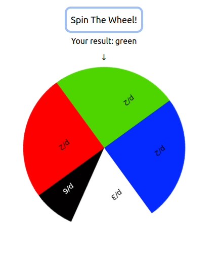

This is a simple and fun fortune wheel example project.

## Quick start

* clone repository
* `cd fortune_wheel & cp .env.template .env`
* `sudo docker compose up -d`
* discover `http://localhost:8000/'`
* try user `test` with the password `test`

